<a name="readme-top"></a>

<!-- PROJECT LOGO -->
<br />
<div align="center">
  <a href="https://github.com/ccizer/Cloud-Foundry-Workshop">
    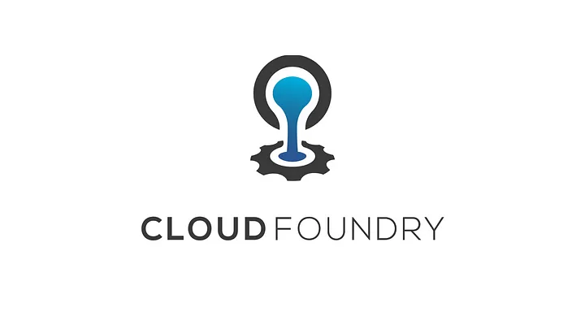
  </a>

<h3 align="center">Cloud Foundry Workshop</h3>
  <p align="center">
    A brief introduction to Cloud Foundry  
    <br />
    <br />
    <a href="https://github.com/ccizer/Cloud-Foundry-Workshop/tree/main/workshop/Customers">Workshop</a>
    ·
    <a href="https://github.com/ccizer/Cloud-Foundry-Workshop/tree/main/resources">Resources</a>
  </p>
</div>


<!-- TABLE OF CONTENTS -->
<details>
  <summary>Table of Contents</summary>
  <ol>
    <li><a href="#what-is-cloud-foundry">What is Cloud Foundry</a></li>
    <li><a href="#prerequisites">Prerequisites</a></li>
    <li><a href="#getting-started">Getting Started</a>
      <ul>
        <li><a href="#cli">The CLI</a></li>
        <li><a href="#using-cloud-foundry">Using a Cloud Foundry</a></li>
        <li><a href="#deploying-your-first-app">Deploying your First App</a></li>
        <li><a href="#ssh-connection">SSH Connection</a></li>
        <li><a href="#logs">Logs</a></li>
     </ul>
    </li>
    <li><a href="#core-concepts">Core Concepts</a>
      <ul>
        <li><a href="#orgs-and-spaces">Orgs and Spaces</a></li>
        <li><a href="#targeting">Targeting</a></li>
        <li><a href="#scope-and-names">Scope and Names</a></li>
        <li><a href="#guids-and-renaming">GUIDs and Renaming</a></li>
        <li><a href="#deleting-app">Deleting App</a></li>
      </ul>
     </li>
     <li><a href="#application-basics">Application Basics</a>
      <ul>
        <li><a href="#source-paths">Source Paths</a></li>
        <li><a href="#manifests">Manifests</a></li>
        <li><a href="#buildpacks">Buildpacks</a></li>
        <li><a href="#scaling">Scaling</a></li>
        <li><a href="#resiliency">Resiliency</a></li>
      </ul>
     </li>
    <li><a href="#application-lifecycle">Application Lifecycle</a>
      <ul>
        <li><a href="#lifecycle-phases">Lifecycle Phases</a></li>
        <li><a href="#containerized-application">Containerized Application</a></li>
        <li><a href="#updating-strategies">Updating Strategies</a></li>
      </ul>
    </li>
    <li><a href="#services">Services</a>
      <ul>
        <li><a href="#lifecycle-phases">Managed Services</a></li>
        <li><a href="#sharing-service-instance">Sharing Service Instance</a></li>
      </ul>
    </li>
    <li><a href="#routes-and-domains">Routes and Domains</a>
      <ul>
        <li><a href="#routes-basics">Routes Basics</a></li>
        <li><a href="#domains-basics">Domains Basics</a></li>
      </ul>
    </li>
    <li><a href="#advanced-topicss">Advanced Topics</a>
      <ul>
        <li><a href="#app-revisions">App Revisions</a></li>
        <li><a href="#stratos">Stratos</a></li>
        <li><a href="#autoscaler">Autoscaler</a></li>
      </ul>
    </li>
    <li><a href="#reference">Reference</a></li>
  </ol>
</details>

<!-- What is Cloud Foundry -->
## What is Cloud Foundry

Cloud Foundry is an open-source platform designed to assist application development teams in building, 
testing, deploying, and scaling their applications. It offers a robust infrastructure, 
including the Kubernetes platform, developer frameworks, and a variety of application services.

Supported by tech giants like Google, IBM, Microsoft, SAP, SUSE, and VMware, Cloud Foundry is renowned for 
its remarkable user experience for developers. It streamlines the deployment process, relieving developers 
from tedious tasks, and enables them to concentrate solely on coding and delivering business results.

In essence, Cloud Foundry mitigates the complexity of managing and executing containerized workloads for developers, 
permitting them to focus on the application code and its impact on the business. 
In addition to simplifying these processes, Cloud Foundry also comes with inherent benefits such as the provision 
of containerization and packaging.

<!-- Prerequisites -->
## Prerequisites

Before you begin utilizing Cloud Foundry, there are several preliminary steps that must be completed.

* Install CF CLI
  ```sh
  brew install cf-cli@8
  ```
* Register to the Service Provider <a href="https://paas.anynines.com/">Anynines</a>
* A preferred IDE or Text Editor
* JDK8
* Maven
<p align="right">(<a href="#readme-top">back to top</a>)</p>

<!-- Getting Started -->
## Getting Started

### The CLI

The cf CLI is communicating with the Cloud Foundry API, enabling developers to make requests to the API in a user-friendly way.

* Show version
  ```sh
  cf version
  ```
* Show documentation
  ```sh
  cf help
  ```
  ```sh
  cf help -a
  ```
  ```sh
  cf <command> -h
  ```
* Aliases
  ```sh
  cf -v
  ```
  
### Using a Cloud Foundry

The Cloud Foundry Command Line Interface (cf CLI) is the tool used for communicating with any instance of Cloud Foundry. 
It operates by making RESTful calls to the specific API endpoint of the Cloud Foundry instance in use.

* Setting the Endpoint
  ```sh
  cf api <API_ENDPOINT>
  ```
  ```sh
  cf api https://api.de.a9s.eu
  ```
  ```sh
  cf api
  ```
* Authentication
  ```sh
  cf login
  ```
* Logout 
  ```sh
  cf logout
  ```

### Deploying your First App

Cloud Foundry is a specially designed platform intended to enhance the developer experience by simplifying the processes of deploying and managing applications.

1. Here is my source code,
2. Run it on the cloud for me.
3. I do not care how.

* cf push command
  ```sh
  cd resources/first-push
  ```
  ```sh
  cf push
  ```
The push command, by default, searches for a manifest.yml file in the current directory and uses it to deploy the application.

```yml
applications:
  - name: first-push #This is the name of your application in Cloud Foundry.
    memory: 32M #This indicates the memory allocated for the container of each application instance.
    disk_quota: 64M #This denotes the disk space allocation for the container of each application instance.
    instances: 1 #This represents the number of instances of the application that Cloud Foundry is instructed to create.
    random-route: true #This implies that Cloud Foundry should autonomously generate a random route for application access.
    buildpacks: #This specifies the buildpack(s) to be used in containerizing your application. In this scenario, only the staticfile_buildpack is necessary.
      - staticfile_buildpack
```

### SSH Connection

* Check SSH is enabled
  ```sh
  cf ssh-enabled first-push
  ```
* Enable SSH connection
   ```sh
  cf enable-ssh first-push
  ```
* Connect to an app instance using ssh
  ```sh
  cf ssh first-push -i 0
  ```
### Logs

* Print real-time logs
  ```sh
  cf logs training-app
  ```
* Print recent logs
  ```sh
  cf logs --recent training-app
  ```
* Print events
  ```sh
  cf events training-app
  ```
  
<p align="right">(<a href="#readme-top">back to top</a>)</p>

<!-- Core Concepts -->
## Core Concepts

### Orgs and Spaces

Organizations (orgs) and spaces represent logical divisions within a Cloud Foundry instance. 
Orgs serve as the parent structure for spaces, and a single org can encompass multiple spaces.

Orgs are frequently used to distinguish between tenants or projects. For instance, you might want to partition your Cloud Foundry instance 
into distinct orgs for different business units. Within each org, you could create separate spaces for various stages of the lifecycle, such as development, staging, and production.

Even though the usage of orgs and spaces is mandatory in Cloud Foundry, the way in which you employ them is entirely at your discretion.

### Targeting

* Show the current target (orgs and spaces)
  ```sh
  cf target
  ```
* Change the target  
  ```sh
  cf target -o <org> -s <space>
  ```
  
### Scope and Names

In the previous segment, we deployed an application to a space. All applications are deployed within a space, and each space is associated with a specific org (you cannot directly deploy an app to an org). As you will learn later in the course, other components, such as service instances and routes, are also assigned to specific spaces. Therefore, before you can manage the resources of a space, you need to target it first.

When you used the cf push command to deploy the app, you provided a name for it (via the manifest), in this case, 'first-push'. By naming the app, you can refer to it more conveniently within Cloud Foundry. Although some commands may default to using these names (like when creating a route for your 'first-push' app), the names are primarily meant for human use. We will delve deeper into resource names later in this module.

You can retrieve details of your app by using its name with the following command:

  ```sh
  cf app first-push
  ```

Since apps are confined to a specific space, their names must be unique within that space. However, the names don't have to be unique outside of that space. Therefore, you could have an app named 'first-push' in the development, staging, and production spaces. Likewise, other users can have their own 'first-push' app within their respective spaces.

Resource names hold significant importance in Cloud Foundry. They are frequently used when executing actions with the CLI and, in certain scenarios, are set based on a default value. Consider the 'first-push' example once again. The app manifest contains `random_route: true`. This instruction tells Cloud Foundry to generate a random route for our app using the resource name.

If the random-route directive hadn't been established, a default route would have been created, which would be based on the chosen resource name. In our example, the default route would look something like `http://first-push.<mydomain.io>`.

### GUIDs and Renaming

Along with resource names, objects created in Cloud Foundry are assigned a globally unique identifier (GUID). Like resource names, an object's GUID will sometimes be passed to CLI commands. Unlike resource names, guids are globally unique.

You can rename certain objects in Cloud Foundry. When an object is renamed, the GUID does not change.

* Print app details with guid
  ```sh
  cf app first-push --guid
  ```
* Rename the app 
  ```sh
  cf rename first-push renamed-app
  ```
* GUID is still same
  ```sh
  cf app first-push --guid
  ```

### Deleting App

* Delete app command
  ```sh
  cf delete -r renamed-app
  ```

The `-r` flag tells Cloud Foundry to also delete the route.
<p align="right">(<a href="#readme-top">back to top</a>)</p>

<!-- Application Basics -->
## Application Basics

### Source Paths

Source path locates a path to the application when running `cf push` command. If it is not specified, then the content in the current directory that the `cf push` command from are pushed up.
This may not be the case for all the application, sometimes it must be necessary to imply the source path when using `cf push` command not to get an unexpected result.

To specify the source path `--path (or -p)` flag can be used or it can be specified in the manifest file as well;

 ```yml
 applications:
   ...
   path: /path/to/app/bits
 ```

.zip files which contains app code can be pushed to the Cloud Foundry without unzipped. Specifying a path for the .zip files is mandatory.
Cloud Foundry won't unzip the file before deploying it, if the source path is not defined. 

* Push a zip file with path
  ```sh
  cd resources/zip-file
  ```
  ```sh
  cf push zip-with-src-path -p app.zip -b staticfile_buildpack -m 32M -k 64M --random-route
  ```
* Push a zip file without a path
  ```sh
  cf push zip-no-src-path -b staticfile_buildpack -m 32M -k 64M --random-route
  ```
* Delete app
  ```shell
  cf delete -r zip-no-src-path
  ```
  
### Manifests

Manifests support the parameterization of values. Variables are declared inside double parenthesis like `((my-variable))`

 ```yml
 applications:
 - name: training-app
   instances: ((instances))
   memory: 64M
   buildpacks:
   - go_buildpack
 ```

* Push with a variable
  ```sh
  cd resources/training-app
  ```
  ```sh
  cf push -f manifest.yml -p training-app.zip --var instances=1
  ```

It is also possible to create `vars` file for each environment (development, staging, prod etc) rather than command line.

* Create vars file `training-app_dev.yml` with `instances: 1`
* Push with the flag `--vars-file` 
  ```sh
  cf push -f manifest.yml -p training-app.zip --vars-file=training-app_dev.yml
  ```

### Buildpacks

Buildpacks play a vital role in containerizing your application, essentially furnishing the required runtime environment for your application. 
Each buildpack is designed to cater to a specific programming language or framework. For instance, the Python buildpack is capable of constructing runtimes for Python apps, 
the Java buildpack for Java apps, and the Go buildpack for Go-lang apps, among others.
The staticfile buildpack, which we've utilized up until now, employs nginx to serve static content.

* List available buildpacks
  ```sh
  cf buildpacks
  ```

### Environment Variables

To inject configuration values into application, environment variables are used.

* Push the example app
  ```sh
  cf push training-app -f manifest.yml -p training-app.zip --random-route
  ```
* Set environment variables
  ```sh
  cf set-env training-app TRAINING_KEY_1 training-value-1
  cf set-env training-app TRAINING_KEY_2 training-value-2
  cf set-env training-app TRAINING_KEY_3 training-value-3
  ```
* Check the browser
* Restart the app
  ```sh
  cf restage training-app
  ```
* Inspect environment variables
  ```sh
  cf env training-app
  ```

To remove the environment variable `cf unset-env` command must be used.

* Remove environment variable
  ```sh
  cf unset-env training-app TRAINING_KEY_1
  ```
* Restart the app
  ```sh
  cf restage training-app
  ```

Cloud Foundry also injects configuration for the application via environment variables.

* VCAP_APPLICATION: configuration and information about the application instance
* VCAP_SERVICES: configuration to access service instances

### Scaling

* Horizontal Scaling
  ```sh
  cf scale -i 2 training-app
  ```
* Check the details of the app with `instances: 2/2` output
  ```sh
  cf app training-app
  ```

* Vertical Scaling
  ```sh
  cf scale -m 48M -k 256M training-app
  ```
* Also in manifest file
  ```yml
  applications:
  - name: training-app
    memory: 48M
    disk-quota: 256M
    instances: 2
  ```

### Resiliency

Cloud Foundry supports resiliency for the scaled applications.

* Log the application
  ```sh
  cf logs training-app
  ```
* Kill the application by calling `/kill` endpoint
* Check application instances
  ```sh
  cf app training-app
  ```
<p align="right">(<a href="#readme-top">back to top</a>)</p>

## Application Lifecycle

### Lifecycle Phases

There are three stages that `push` command contains

* Uploading: loads the source files
* Staging: creates the container image
* Starting: runs the containerized application

Also, there three ways to roll out an update on the application

* `restart`: same code, same config, same image, new container instance (no content/code change, only restart application)
* `restage`: same code, new config, new image, new container (ex. adding a binding service)
* `push`: new code, new config, new image, new container (code change)

### Containerized Application

Containerized application includes the app code, runtime dependencies, stack, deployment and application configurations.

* The app code and runtime dependencies are combined in a unit called a "droplet" during the staging process.
* A deployment configuration contains the values located in the manifest.yml file like instances, quotas, memory buildpacks etc.
* Developers should provide app code, runtime (buildpacks) and deployment configuration.
* A Stack is the prebuild filesystem used in constructing the container image.
* An application configuration consists of the environment variables and the default variables injected by Cloud Foundry which are VCAP_APPLICATION and VCAP_SERVICES.
        
### Updating Strategies

When updating an application, `--strategy rolling` flag can be used for all restart/restage/re-push commands to provide zero downtime deployments.
If it is not used, all application instances will be stopped at the same time. With `--strategy rolling`, application instances are updated one at a time.

* Change directory to updating-app
  ```sh
  cd resources/updating-app 
  ```
* Push the updating-app
  ```sh
  cf push 
  ```
* Watch the application output in a different terminal tab
  ```sh
  watch -n 0.5 curl -L <ROUTE-TO-YOUR-APP> 
  ```
* Watch the application detail in a different terminal tab
  ```sh
  watch cf app updating-app
  ```
* Change the color from BLUE to GREEN in index.html
* Update the application with `--strategy rolling` command
  ```sh
  cf push --strategy rolling
  ```

The deployment can be canceled with the `cancel-deployment` command.

* Change the color from GREEN to RED in index.html
* Update the application with `--strategy rolling --no-wait` command
  ```sh
  cf push --strategy rolling --no-wait
  ```
* Cancel the deployment
  ```sh
  cf cancel-deployment updating-app
  ```
<p align="right">(<a href="#readme-top">back to top</a>)</p>

## Services

### Managed Services

Cloud Foundry provides managed services ,the ability to discover and provision services like a database or message queue, 
when an application requires to connect to external services.

* List marketplace
  ```sh
  cf marketplace
  ```
* Show details of a service
  ```sh
  cf marketplace -e <SERVICE_NAME>
  ```
* Provision a service instance
  ```sh
  cf create-service a9s-postgresql11 postgresql-single-nano training-app-db
  ```
* List provisioned services 
  ```sh
  cf services
  ```
* Bind the service to an application
  ```sh
  cf bind-service training-app training-app-db
  ```
* Print environment variables to see the credentials in VCAP_SERVICES 
  ```sh
  cf env training-app
  ```
* Restart (or restage) the application to pick up the config change in the environment
  ```sh
  cf restart training-app
  ```
A service can be also binded using the manifest.yml file.

  ```yml
  services:
    - training-app-db
   ```
* Unused service can be unbinded 
  ```sh
  cf unbind-service training-app training-app-db
  ```
* Print environment variables to see the credentials were removed in VCAP_SERVICES
  ```sh
  cf env training-app
  ```
* Restart (or restage) the application to pick up the config change in the environment
  ```sh
  cf restart training-app
  ```
* Deprovision the service instance
  ```sh
  cf delete-service training-app-db
  ```

### Sharing Service Instance

* Share service instance on another space
  ```sh
  cf share-service training-app-db -s services
  ```
* Change the target to the services space
  ```sh
  cf target -s services
  ```
* Print the available services
  ```sh
  cf service training-app-db
  ```
* Unshare the instance
  ```sh
  cf unshare-service training-app-db -s services
  ```
* Change the target to the services space
  ```sh
  cf target -s services
  ```
* Print the available services
  ```sh
  cf service training-app-db
  ```
<p align="right">(<a href="#readme-top">back to top</a>)</p>

## Routes and Domains

### Routes Basics

* List routes
  ```sh
  cf routes
  ```
* Create route
  ```sh
  cf create-route <CF_APP_DOMAIN> --hostname <SOME_UNIQUE_HOSTNAME>
  ```
* Map route
  ```sh
  cf map-route training-app <CF_APP_DOMAIN> --hostname <SOME_UNIQUE_HOSTNAME>
  ```
* Check the new route on application details
  ```sh
  cf app training-app
  ```
* Unmap route
  ```sh
  cf unmap-route training-app <CF_APP_DOMAIN> --hostname <OLD_HOSTNAME>
  ```
* Delete route
  ```sh
  cf delete-route <CF_APP_DOMAIN> --hostname <OLD_HOSTNAME>
  ```
* Check the existing routes
  ```sh
  cf routes
  ```

### Domains Basics

Apps.internal is the internal domain where the existing applications can connect to each other using that domain. 
It cannot be connected outside of Cloud Foundry. 

* List domains
  ```sh
  cf domains
  ```

## Advanced Topics

### App Revisions

Older version of the code and configuration are kept as app revisions in Cloud Foundry to see the history of the app or roll back to a previous version.

* List revisions
  ```sh
  cf revisions training-app
  ```
* Roll back to a previous revision
  ```sh
  cf rollback training-app --version <REVISION_NUMBER>
  ```
### Stratos

Stratos is the UI designed for the developers to manage Cloud Foundry in a more visual and easier way.

* Run Stratos with docker container
  ```sh
  docker run -p 4443:5443 splatform/stratos:latest
  ```
* Login to the application using the link `https://localhost:4443`
  * Select Local Admin
    <br/>
    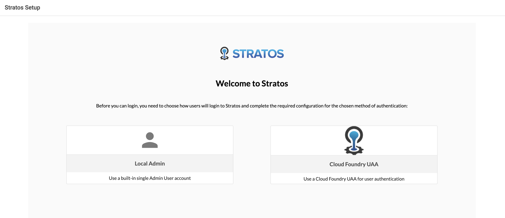
  * Setup Admin
    <br/>
    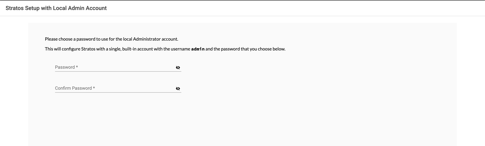
  * Register Endpoint
    <br/>
    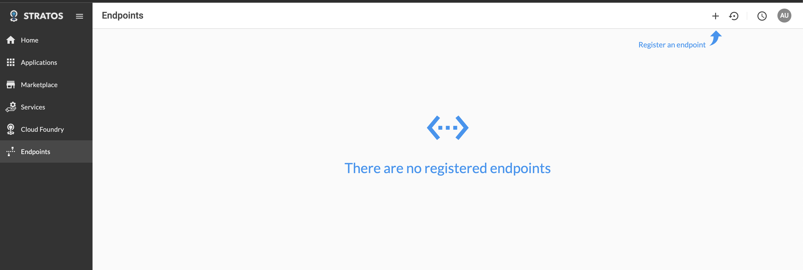
  * Select Cloud Foundry
    <br/>
    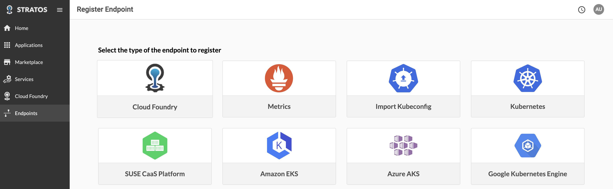
  * Enter Entrypoint
    <br/>
    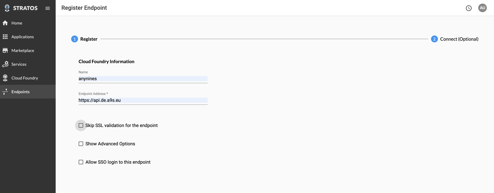
  * Enter Credentials
    <br/>
    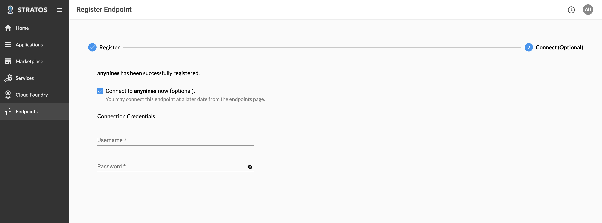
  * Homepage
    <br/>
    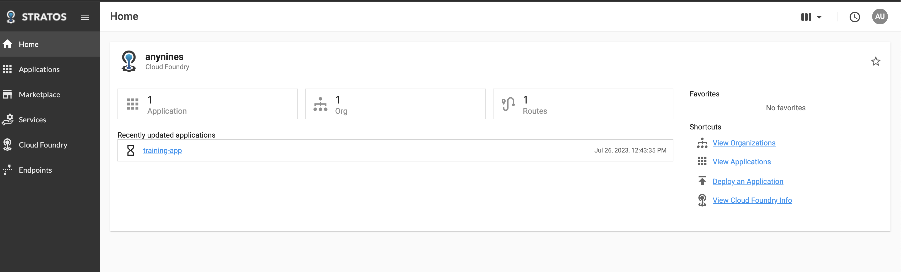

## Autoscaler

Autoscaler scales the applications automatically based on the performance metrics or a scheduler. Autoscaler can be provisioned and then 
binded to the applications just like the other services.

* Create Autoscaler service
  ```sh
  cf create-service autoscaler autoscaler training-app-autoscaler
  ```
* Bind Autoscaler to the application
  ```sh
  cf bind-service training-app training-app-autoscaler
  ```
* Login Stratos, select the application and then the Autoscale menu item
  <br/>
  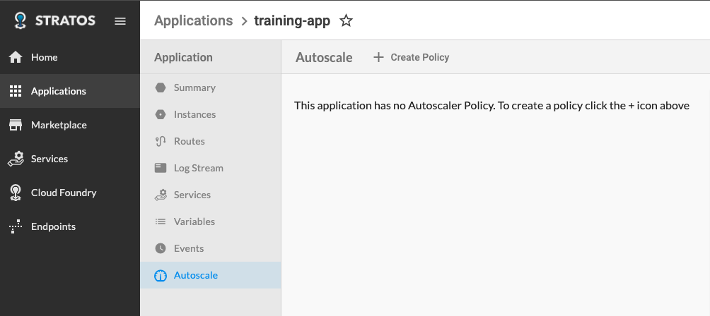
* Click Create Policy and set min/max instance count
  <br/>
  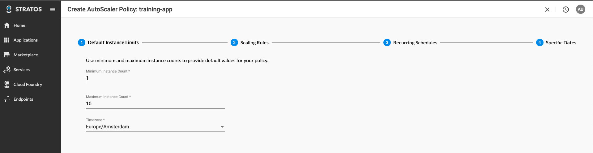
* Add a new scaling policy
  <br/>
  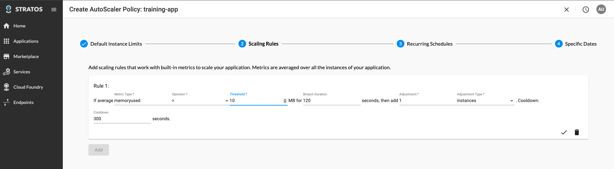

<p align="right">(<a href="#readme-top">back to top</a>)</p>

## Reference

* <a href="https://training.linuxfoundation.org/training/cloud-foundry-for-developers/">Cloud Foundry For Developers</a>
